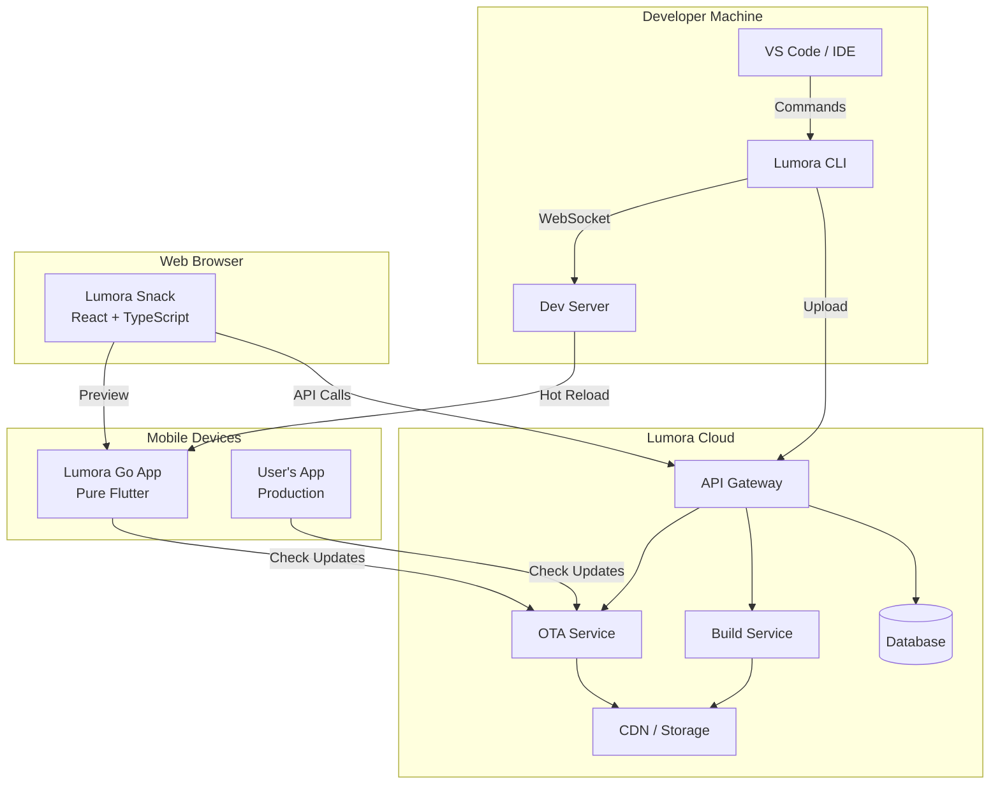
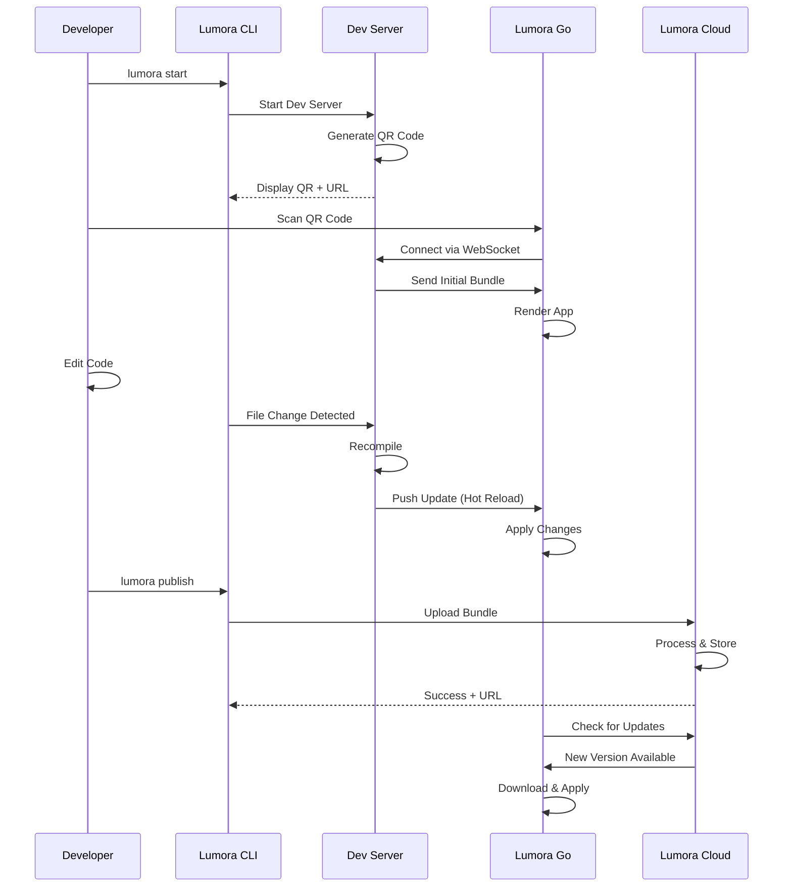

# Design Document

## Overview

Lumora will be transformed into a comprehensive Expo-like platform for Flutter development, consisting of four main components:

1. **Lumora CLI** - Enhanced command-line tool for project management
2. **Lumora Go** - Pure Flutter mobile app for instant previews (Android & iOS)
3. **Lumora Snack** - React/TypeScript web playground for browser-based development
4. **Lumora Cloud** - Backend services for OTA updates, builds, and collaboration

This design follows Expo's proven architecture while leveraging Flutter's native capabilities and maintaining compatibility with the existing Lumora IR system.

## Architecture

### High-Level System Architecture



### Component Interaction Flow



## Components and Interfaces

### 1. Lumora CLI (Enhanced)

#### Architecture

```typescript
// Core CLI Structure
lumora-cli/
├── src/
│   ├── commands/
│   │   ├── init.ts          // Project initialization
│   │   ├── start.ts         // Dev server (enhanced)
│   │   ├── build.ts         // Local builds
│   │   ├── publish.ts       // OTA publishing
│   │   ├── eas/
│   │   │   ├── build.ts     // Cloud builds
│   │   │   ├── submit.ts    // App store submission
│   │   │   └── update.ts    // Update management
│   │   ├── doctor.ts        // Environment diagnostics
│   │   ├── devices.ts       // Device management
│   │   └── share.ts         // Project sharing
│   ├── services/
│   │   ├── dev-server.ts    // Enhanced dev server
│   │   ├── bundler.ts       // Code bundling
│   │   ├── hot-reload.ts    // Hot reload engine
│   │   ├── qr-generator.ts  // QR code generation
│   │   ├── cloud-client.ts  // Cloud API client
│   │   └── analytics.ts     // Usage analytics
│   ├── utils/
│   │   ├── flutter-tools.ts // Flutter SDK integration
│   │   ├── config.ts        // Configuration management
│   │   └── logger.ts        // Logging utilities
│   └── cli.ts               // Main entry point
```

#### Key Interfaces

```typescript
// Project Configuration
interface LumoraConfig {
  name: string;
  slug: string;
  version: string;
  sdkVersion: string;
  platforms: ('ios' | 'android' | 'web')[];
  splash: SplashConfig;
  icon: string;
  updates: UpdatesConfig;
  ios?: IOSConfig;
  android?: AndroidConfig;
  plugins?: PluginConfig[];
}

// Dev Server Interface
interface DevServer {
  start(options: DevServerOptions): Promise<void>;
  stop(): Promise<void>;
  getConnectedDevices(): Device[];
  sendUpdate(update: Update): Promise<void>;
  on(event: string, handler: Function): void;
}

// Cloud Client Interface
interface CloudClient {
  publish(bundle: Bundle, options: PublishOptions): Promise<PublishResult>;
  build(config: BuildConfig): Promise<BuildJob>;
  getBuildStatus(jobId: string): Promise<BuildStatus>;
  getUpdates(appId: string): Promise<Update[]>;
}
```

#### Enhanced Dev Server Features

1. **Multi-Device Support**: Handle multiple simultaneous connections
2. **Incremental Compilation**: Only recompile changed modules
3. **Source Maps**: Generate source maps for debugging
4. **Error Overlay**: Send detailed error information to devices
5. **Network Inspector**: Log and display network requests
6. **Performance Metrics**: Track and report performance data

### 2. Lumora Go (Pure Flutter Mobile App)

#### Architecture

```
lumora_go/
├── lib/
│   ├── main.dart
│   ├── app.dart
│   ├── screens/
│   │   ├── home_screen.dart          // QR scanner + project list
│   │   ├── project_screen.dart       // Running project view
│   │   ├── dev_menu_screen.dart      // Developer menu
│   │   └── settings_screen.dart      // App settings
│   ├── services/
│   │   ├── connection_service.dart   // WebSocket connection
│   │   ├── bundle_loader.dart        // Load and cache bundles
│   │   ├── hot_reload_service.dart   // Hot reload engine
│   │   ├── update_service.dart       // OTA updates
│   │   └── analytics_service.dart    // Usage tracking
│   ├── widgets/
│   │   ├── qr_scanner.dart           // QR code scanner
│   │   ├── error_overlay.dart        // Error display
│   │   ├── performance_overlay.dart  // Performance monitor
│   │   └── dev_menu.dart             // Developer menu
│   ├── runtime/
│   │   ├── interpreter.dart          // Lumora IR interpreter
│   │   ├── widget_registry.dart      // Widget mapping
│   │   ├── state_manager.dart        // State management
│   │   └── event_bridge.dart         // Event handling
│   └── utils/
│       ├── storage.dart              // Local storage
│       ├── logger.dart               // Logging
│       └── network.dart              // Network utilities
├── android/
│   └── app/
│       └── src/main/
│           └── AndroidManifest.xml
├── ios/
│   └── Runner/
│       └── Info.plist
└── pubspec.yaml
```

#### Key Features

1. **QR Code Scanner**: Scan QR codes from Lumora CLI to connect
2. **Project Runtime**: Interpret and render Lumora IR schemas
3. **Hot Reload**: Apply code changes without losing state
4. **Developer Menu**: Accessible via shake gesture
   - Reload app
   - Toggle performance monitor
   - Toggle element inspector
   - View logs
   - Change update channel
5. **Offline Support**: Cache projects for offline access
6. **Multi-Project**: Switch between multiple projects
7. **Update Management**: Check and apply OTA updates

#### Core Interfaces

```dart
// Connection Service
class ConnectionService {
  Future<void> connect(String url);
  void disconnect();
  Stream<Update> get updates;
  void sendEvent(String event, Map<String, dynamic> data);
}

// Bundle Loader
class BundleLoader {
  Future<Bundle> loadFromUrl(String url);
  Future<Bundle> loadFromCache(String projectId);
  Future<void> cacheBundle(String projectId, Bundle bundle);
}

// Hot Reload Service
class HotReloadService {
  Future<void> applyUpdate(Update update);
  void preserveState();
  void restoreState();
}

// Lumora IR Interpreter
class LumoraInterpreter {
  Widget buildFromSchema(Map<String, dynamic> schema);
  void registerCustomWidget(String name, WidgetBuilder builder);
  void updateSchema(Map<String, dynamic> schema);
}
```

#### Widget Registry

The app includes a comprehensive widget registry that maps Lumora IR components to Flutter widgets:

```dart
class WidgetRegistry {
  static final Map<String, WidgetBuilder> _registry = {
    'View': (props) => Container(...),
    'Text': (props) => Text(...),
    'Button': (props) => ElevatedButton(...),
    'Image': (props) => Image.network(...),
    'ScrollView': (props) => SingleChildScrollView(...),
    'ListView': (props) => ListView.builder(...),
    'TextInput': (props) => TextField(...),
    'Switch': (props) => Switch(...),
    // ... more widgets
  };
  
  void register(String name, WidgetBuilder builder) {
    _registry[name] = builder;
  }
  
  Widget build(String type, Map<String, dynamic> props) {
    return _registry[type]?.call(props) ?? Container();
  }
}
```

### 3. Lumora Snack (React + TypeScript Web Playground)

#### Architecture

```
lumora-snack/
├── src/
│   ├── components/
│   │   ├── Editor/
│   │   │   ├── CodeEditor.tsx        // Monaco editor
│   │   │   ├── FileTree.tsx          // File explorer
│   │   │   └── Terminal.tsx          // Output console
│   │   ├── Preview/
│   │   │   ├── DeviceFrame.tsx       // Device simulator
│   │   │   ├── QRCode.tsx            // QR for device testing
│   │   │   └── ErrorBoundary.tsx     // Error handling
│   │   ├── Toolbar/
│   │   │   ├── ActionBar.tsx         // Save, share, run
│   │   │   └── DeviceSelector.tsx    // Device type selector
│   │   └── Layout/
│   │       ├── SplitPane.tsx         // Resizable panes
│   │       └── Header.tsx            // App header
│   ├── services/
│   │   ├── compiler.ts               // Dart compilation
│   │   ├── bundler.ts                // Bundle generation
│   │   ├── preview.ts                // Preview management
│   │   ├── storage.ts                // Project storage
│   │   └── api.ts                    // Backend API
│   ├── hooks/
│   │   ├── useProject.ts             // Project state
│   │   ├── useCompiler.ts            // Compilation
│   │   └── usePreview.ts             // Preview state
│   ├── types/
│   │   ├── project.ts                // Project types
│   │   └── api.ts                    // API types
│   └── App.tsx
├── public/
└── package.json
```

#### Key Features

1. **Monaco Editor**: Full-featured code editor with Dart syntax highlighting
2. **Live Preview**: Real-time preview in device frame
3. **File Management**: Create, edit, delete files and folders
4. **Package Management**: Add Flutter packages via UI
5. **Device Testing**: Generate QR code for testing on Lumora Go
6. **Project Sharing**: Share projects via URL
7. **Templates**: Start from pre-built templates
8. **Collaboration**: Real-time collaborative editing (future)

#### Core Interfaces

```typescript
// Project Interface
interface Project {
  id: string;
  name: string;
  description: string;
  files: FileNode[];
  dependencies: Record<string, string>;
  settings: ProjectSettings;
}

// Compiler Service
interface CompilerService {
  compile(files: FileNode[]): Promise<CompileResult>;
  watch(files: FileNode[], onChange: (result: CompileResult) => void): void;
  stop(): void;
}

// Preview Service
interface PreviewService {
  start(bundle: Bundle): Promise<string>; // Returns preview URL
  update(bundle: Bundle): Promise<void>;
  stop(): Promise<void>;
  getQRCode(): string;
}
```

### 4. GitHub-Based Cloud Services

Instead of building custom cloud infrastructure, Lumora will leverage GitHub for project storage, sharing, and distribution. This approach provides:
- Free hosting for public projects
- Built-in version control
- Collaboration features
- No infrastructure costs
- Familiar developer workflow

#### Architecture

```
lumora-github-integration/
├── src/
│   ├── github-client.ts          // GitHub API client
│   ├── repository-manager.ts     // Repo operations
│   ├── release-manager.ts        // GitHub Releases for OTA
│   ├── gist-manager.ts           // Gists for Snack projects
│   └── auth-manager.ts           // OAuth/PAT authentication
└── package.json
```

#### GitHub Integration Points

```typescript
// Project Storage
- Create GitHub repository for each Lumora project
- Store source code, schemas, and assets
- Use GitHub Actions for CI/CD

// OTA Updates via GitHub Releases
- Publish bundles as GitHub Releases
- Use release tags for versioning
- Download bundles from release assets
- Leverage GitHub CDN for distribution

// Snack Projects via GitHub Gists
- Store Snack projects as Gists
- Share via Gist URLs
- Fork Gists for remixing

// Collaboration
- Use GitHub Issues for bug tracking
- Use GitHub Discussions for community
- Use GitHub Pull Requests for contributions
```

#### GitHub API Usage

```typescript
// Repository Management
POST   /repos/:owner/:repo                    // Create repository
GET    /repos/:owner/:repo                    // Get repository
PUT    /repos/:owner/:repo                    // Update repository
GET    /repos/:owner/:repo/contents/:path     // Get file contents

// Releases (for OTA Updates)
POST   /repos/:owner/:repo/releases           // Create release
GET    /repos/:owner/:repo/releases/latest    // Get latest release
GET    /repos/:owner/:repo/releases/:id       // Get specific release
GET    /repos/:owner/:repo/releases/:id/assets // Get release assets

// Gists (for Snack)
POST   /gists                                 // Create gist
GET    /gists/:id                             // Get gist
PATCH  /gists/:id                             // Update gist
POST   /gists/:id/forks                       // Fork gist

// Authentication
- GitHub OAuth for web authentication
- Personal Access Tokens (PAT) for CLI
- GitHub Apps for advanced integrations
```

#### Data Storage Strategy

```typescript
// Project Structure in GitHub
my-lumora-app/
├── .lumora/
│   ├── config.json              // Lumora configuration
│   ├── schemas/                 // Generated IR schemas
│   └── bundles/                 // Production bundles
├── web/
│   └── src/                     // React/TSX source
├── mobile/
│   └── lib/                     // Generated Flutter code
├── assets/                      // Images, fonts, etc.
└── README.md

// Release Assets for OTA
- Bundle file: app-bundle-v1.0.0.tar.gz
- Manifest file: manifest.json
- Checksums: checksums.txt

// Gist Structure for Snack
{
  "App.tsx": { "content": "..." },
  "package.json": { "content": "..." },
  "lumora.config.json": { "content": "..." }
}
```

## Data Models

### Lumora IR Schema (Enhanced)

```typescript
interface LumoraSchema {
  version: string;
  metadata: {
    name: string;
    version: string;
    description?: string;
    author?: string;
  };
  dependencies: Record<string, string>;
  assets: Asset[];
  screens: Screen[];
  components: Component[];
  state: StateDefinition;
  navigation: NavigationConfig;
}

interface Screen {
  id: string;
  name: string;
  route: string;
  component: string;
  params?: Record<string, any>;
}

interface Component {
  id: string;
  type: string;
  props: Record<string, any>;
  children?: Component[];
  events?: EventHandler[];
}

interface StateDefinition {
  stores: Store[];
  actions: Action[];
  effects: Effect[];
}

interface Asset {
  id: string;
  type: 'image' | 'font' | 'video' | 'audio';
  url: string;
  metadata?: Record<string, any>;
}
```

### Update Manifest

```typescript
interface UpdateManifest {
  id: string;
  version: string;
  channel: string;
  bundleUrl: string;
  assets: AssetManifest[];
  launchAsset: string;
  metadata: {
    size: number;
    checksum: string;
    createdAt: string;
  };
  rollbackable: boolean;
  minAppVersion?: string;
}

interface AssetManifest {
  path: string;
  url: string;
  checksum: string;
  size: number;
}
```

### Build Configuration

```typescript
interface BuildConfig {
  platform: 'ios' | 'android';
  buildType: 'debug' | 'release';
  bundleIdentifier: string;
  version: string;
  buildNumber: number;
  signing?: SigningConfig;
  environment?: Record<string, string>;
}

interface SigningConfig {
  keystore?: string; // Android
  keystorePassword?: string;
  keyAlias?: string;
  keyPassword?: string;
  certificate?: string; // iOS
  provisioningProfile?: string;
  teamId?: string;
}
```

## Error Handling

### Error Categories

1. **Network Errors**: Connection failures, timeouts
2. **Compilation Errors**: Dart syntax errors, type errors
3. **Runtime Errors**: Null pointer, state errors
4. **Build Errors**: Native build failures
5. **Update Errors**: Failed downloads, corrupted bundles

### Error Handling Strategy

```typescript
class ErrorHandler {
  handle(error: Error): ErrorResponse {
    if (error instanceof NetworkError) {
      return this.handleNetworkError(error);
    } else if (error instanceof CompilationError) {
      return this.handleCompilationError(error);
    } else if (error instanceof RuntimeError) {
      return this.handleRuntimeError(error);
    }
    return this.handleUnknownError(error);
  }
  
  private handleNetworkError(error: NetworkError): ErrorResponse {
    return {
      type: 'network',
      message: 'Connection failed. Check your internet connection.',
      retry: true,
      suggestions: [
        'Check your internet connection',
        'Verify the server is running',
        'Check firewall settings'
      ]
    };
  }
  
  private handleCompilationError(error: CompilationError): ErrorResponse {
    return {
      type: 'compilation',
      message: error.message,
      file: error.file,
      line: error.line,
      column: error.column,
      suggestions: this.getCompilationSuggestions(error)
    };
  }
}
```

### Error Display

- **CLI**: Formatted error messages with colors and suggestions
- **Lumora Go**: Full-screen error overlay with stack trace
- **Snack**: Inline error markers in editor + console output

## Testing Strategy

### Unit Tests

- **CLI**: Test each command and service independently
- **Lumora Go**: Test services, widgets, and utilities
- **Snack**: Test components, hooks, and services
- **Cloud**: Test API endpoints, business logic

### Integration Tests

- **End-to-End Flow**: Test complete workflow from init to publish
- **Device Connection**: Test QR scanning and WebSocket connection
- **Hot Reload**: Test code changes and state preservation
- **OTA Updates**: Test update download and application

### Performance Tests

- **Bundle Size**: Ensure bundles are optimized
- **Hot Reload Speed**: Measure reload time (target < 2s)
- **App Startup**: Measure Lumora Go startup time
- **Build Time**: Measure cloud build duration

### Test Tools

- **Jest**: Unit and integration tests for TypeScript code
- **Flutter Test**: Widget and integration tests for Dart code
- **Cypress**: E2E tests for Snack web app
- **k6**: Load testing for cloud services

## Security Considerations

### Authentication & Authorization

- JWT-based authentication for API access
- API keys for CLI and Lumora Go
- OAuth integration for third-party services
- Role-based access control (RBAC)

### Data Protection

- HTTPS/WSS for all network communication
- Encryption at rest for sensitive data
- Secure credential storage (keychain/keystore)
- Regular security audits

### Code Signing

- Sign all OTA updates with private key
- Verify signatures before applying updates
- Certificate pinning for API communication
- Secure build artifact storage

## Performance Optimization

### Bundle Optimization

- Tree shaking to remove unused code
- Code splitting for lazy loading
- Asset compression and optimization
- Differential updates (only changed files)

### Caching Strategy

- Cache bundles locally on device
- CDN caching for assets and updates
- Service worker for Snack offline support
- Redis caching for API responses

### Network Optimization

- WebSocket for real-time communication
- HTTP/2 for parallel requests
- Compression (gzip/brotli)
- Request batching and debouncing

## Deployment Strategy

### Lumora CLI

- Publish to NPM registry
- Auto-update mechanism
- Version compatibility checks

### Lumora Go

- Publish to App Store and Google Play
- Regular updates with new features
- Backward compatibility with older CLI versions

### Lumora Snack

- Deploy to Vercel/Netlify
- CDN for static assets
- Progressive Web App (PWA) support

### Lumora Cloud

- Kubernetes deployment
- Auto-scaling based on load
- Multi-region deployment
- Blue-green deployment strategy

## Migration Path

### Phase 1: Foundation (Weeks 1-4)
- Enhance Lumora CLI with new commands
- Build basic Lumora Go app with QR scanner
- Set up cloud infrastructure

### Phase 2: Core Features (Weeks 5-8)
- Implement hot reload in Lumora Go
- Build Lumora Snack MVP
- Implement OTA update service

### Phase 3: Advanced Features (Weeks 9-12)
- Add cloud build service
- Implement analytics and monitoring
- Add collaboration features

### Phase 4: Polish & Launch (Weeks 13-16)
- Performance optimization
- Documentation and tutorials
- Beta testing and feedback
- Public launch

## Success Metrics

- **Developer Adoption**: 1000+ active developers in first 3 months
- **App Performance**: < 2s hot reload time, < 5s cold start
- **Reliability**: 99.9% uptime for cloud services
- **User Satisfaction**: 4.5+ star rating on app stores
- **Build Success Rate**: > 95% successful builds
