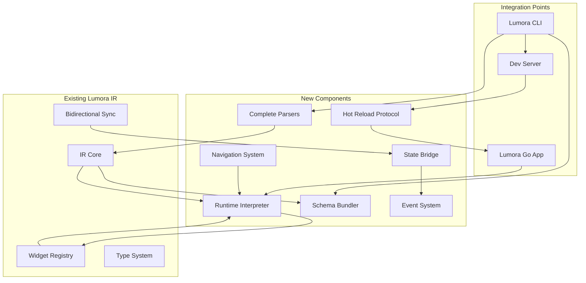

# Design Document - Lumora Engine Completion

## Overview

This document details the design for completing the missing features in the Lumora engine. These features will transform the existing IR system into a complete runtime and development platform, enabling the Expo-like experience.

## Architecture

### System Integration



## Components and Interfaces

### 1. Runtime Interpreter (Lumora Go - Dart/Flutter)

#### Architecture

```dart
// packages/lumora_runtime/lib/interpreter/
class LumoraInterpreter {
  final WidgetRegistry _registry;
  final StateManager _stateManager;
  final EventBridge _eventBridge;
  
  Widget buildFromSchema(Map<String, dynamic> schema) {
    final node = LumoraNode.fromJson(schema);
    return _buildWidget(node);
  }
  
  Widget _buildWidget(LumoraNode node) {
    final builder = _registry.getBuilder(node.type);
    if (builder == null) {
      return _buildFallback(node);
    }
    
    final props = _resolveProps(node.props);
    final children = node.children.map(_buildWidget).toList();
    
    return builder(props, children);
  }
  
  Map<String, dynamic> _resolveProps(Map<String, dynamic> props) {
    // Resolve state references, event handlers, etc.
    return props.map((key, value) {
      if (value is String && value.startsWith('\$')) {
        return MapEntry(key, _stateManager.getValue(value.substring(1)));
      }
      if (value is Map && value['__event'] != null) {
        return MapEntry(key, _eventBridge.createHandler(value['__event']));
      }
      return MapEntry(key, value);
    });
  }
}
```

#### Widget Registry

```dart
class WidgetRegistry {
  final Map<String, WidgetBuilder> _builders = {};
  
  void registerCore() {
    // Core widgets
    register('View', (props, children) {
      return Container(
        width: props['width'],
        height: props['height'],
        padding: _parsePadding(props['padding']),
        margin: _parsePadding(props['margin']),
        decoration: _parseDecoration(props),
        child: children.isEmpty ? null : 
               children.length == 1 ? children[0] : 
               Column(children: children),
      );
    });
    
    register('Text', (props, children) {
      return Text(
        props['text'] ?? props['children'] ?? '',
        style: _parseTextStyle(props['style']),
        textAlign: _parseTextAlign(props['textAlign']),
      );
    });
    
    register('Button', (props, children) {
      return ElevatedButton(
        onPressed: props['onPress'],
        style: _parseButtonStyle(props['style']),
        child: children.isEmpty 
          ? Text(props['title'] ?? '') 
          : children[0],
      );
    });
    
    register('Image', (props, children) {
      final source = props['source'];
      if (source is String) {
        return source.startsWith('http') 
          ? Image.network(source)
          : Image.asset(source);
      }
      return Image.network(source['uri']);
    });
    
    register('ScrollView', (props, children) {
      return SingleChildScrollView(
        scrollDirection: props['horizontal'] == true 
          ? Axis.horizontal 
          : Axis.vertical,
        child: children.isEmpty ? Container() : children[0],
      );
    });
    
    register('ListView', (props, children) {
      return ListView.builder(
        itemCount: children.length,
        itemBuilder: (context, index) => children[index],
      );
    });
    
    register('TextInput', (props, children) {
      return TextField(
        controller: _getController(props['value']),
        onChanged: props['onChange'],
        decoration: InputDecoration(
          hintText: props['placeholder'],
          labelText: props['label'],
        ),
        obscureText: props['secureTextEntry'] == true,
        keyboardType: _parseKeyboardType(props['keyboardType']),
      );
    });
  }
  
  void register(String type, WidgetBuilder builder) {
    _builders[type] = builder;
  }
  
  WidgetBuilder? getBuilder(String type) {
    return _builders[type];
  }
}

typedef WidgetBuilder = Widget Function(
  Map<String, dynamic> props,
  List<Widget> children,
);
```

### 2. Hot Reload Protocol (TypeScript)

#### Protocol Definition

```typescript
// packages/lumora_ir/src/protocol/hot-reload-protocol.ts

export interface HotReloadMessage {
  type: 'connect' | 'update' | 'reload' | 'error' | 'ping' | 'pong';
  sessionId: string;
  timestamp: number;
  payload?: any;
}

export interface SchemaUpdate {
  type: 'incremental' | 'full';
  schema: LumoraIR;
  delta?: SchemaDelta;
  preserveState: boolean;
}

export interface SchemaDelta {
  added: LumoraNode[];
  modified: LumoraNode[];
  removed: string[]; // node IDs
}

export class HotReloadServer {
  private wss: WebSocketServer;
  private sessions: Map<string, Session>;
  
  constructor(port: number) {
    this.wss = new WebSocketServer({ port });
    this.sessions = new Map();
    this.setupHandlers();
  }
  
  private setupHandlers() {
    this.wss.on('connection', (ws, req) => {
      const sessionId = this.extractSessionId(req);
      const session = this.sessions.get(sessionId);
      
      if (!session) {
        ws.close(4404, 'Session not found');
        return;
      }
      
      const device = this.registerDevice(session, ws);
      
      ws.on('message', (data) => {
        const message = JSON.parse(data.toString()) as HotReloadMessage;
        this.handleMessage(device, message);
      });
      
      ws.on('close', () => {
        this.unregisterDevice(session, device);
      });
      
      // Send initial schema
      this.sendSchema(device, session.currentSchema, 'full');
    });
  }
  
  pushUpdate(sessionId: string, schema: LumoraIR) {
    const session = this.sessions.get(sessionId);
    if (!session) return;
    
    const delta = this.calculateDelta(session.currentSchema, schema);
    session.currentSchema = schema;
    
    // Push to all connected devices
    session.devices.forEach(device => {
      if (delta.added.length + delta.modified.length + delta.removed.length < 10) {
        this.sendSchema(device, schema, 'incremental', delta);
      } else {
        this.sendSchema(device, schema, 'full');
      }
    });
  }
  
  private sendSchema(
    device: Device,
    schema: LumoraIR,
    type: 'full' | 'incremental',
    delta?: SchemaDelta
  ) {
    const message: HotReloadMessage = {
      type: 'update',
      sessionId: device.sessionId,
      timestamp: Date.now(),
      payload: {
        type,
        schema: type === 'full' ? schema : undefined,
        delta: type === 'incremental' ? delta : undefined,
        preserveState: true,
      },
    };
    
    device.ws.send(JSON.stringify(message));
  }
  
  private calculateDelta(oldSchema: LumoraIR, newSchema: LumoraIR): SchemaDelta {
    const oldNodes = new Map(oldSchema.nodes.map(n => [n.id, n]));
    const newNodes = new Map(newSchema.nodes.map(n => [n.id, n]));
    
    const added: LumoraNode[] = [];
    const modified: LumoraNode[] = [];
    const removed: string[] = [];
    
    // Find added and modified
    newNodes.forEach((node, id) => {
      const oldNode = oldNodes.get(id);
      if (!oldNode) {
        added.push(node);
      } else if (JSON.stringify(oldNode) !== JSON.stringify(node)) {
        modified.push(node);
      }
    });
    
    // Find removed
    oldNodes.forEach((node, id) => {
      if (!newNodes.has(id)) {
        removed.push(id);
      }
    });
    
    return { added, modified, removed };
  }
}
```

### 3. Schema Bundler (TypeScript)

```typescript
// packages/lumora_ir/src/bundler/schema-bundler.ts

export interface BundleConfig {
  entry: string;
  output: string;
  minify: boolean;
  compress: boolean;
  treeShake: boolean;
  sourceMaps: boolean;
}

export interface Bundle {
  manifest: BundleManifest;
  schemas: Map<string, LumoraIR>;
  assets: Map<string, Buffer>;
  metadata: BundleMetadata;
}

export interface BundleManifest {
  version: string;
  entry: string;
  schemas: SchemaReference[];
  assets: AssetReference[];
  dependencies: Record<string, string>;
  checksum: string;
}

export class SchemaBundler {
  async bundle(config: BundleConfig): Promise<Bundle> {
    const schemas = await this.collectSchemas(config.entry);
    const assets = await this.collectAssets(schemas);
    
    if (config.treeShake) {
      this.treeShake(schemas);
    }
    
    if (config.minify) {
      this.minify(schemas);
    }
    
    const manifest = this.generateManifest(schemas, assets);
    
    const bundle: Bundle = {
      manifest,
      schemas,
      assets,
      metadata: {
        createdAt: Date.now(),
        size: this.calculateSize(schemas, assets),
        compressed: config.compress,
      },
    };
    
    if (config.compress) {
      return this.compress(bundle);
    }
    
    return bundle;
  }
  
  private async collectSchemas(entry: string): Promise<Map<string, LumoraIR>> {
    const schemas = new Map<string, LumoraIR>();
    const visited = new Set<string>();
    
    const collect = async (path: string) => {
      if (visited.has(path)) return;
      visited.add(path);
      
      const schema = await this.loadSchema(path);
      schemas.set(path, schema);
      
      // Collect dependencies
      for (const dep of this.extractDependencies(schema)) {
        await collect(dep);
      }
    };
    
    await collect(entry);
    return schemas;
  }
  
  private treeShake(schemas: Map<string, LumoraIR>) {
    // Remove unused nodes
    const usedNodes = new Set<string>();
    
    // Mark used nodes starting from entry points
    schemas.forEach(schema => {
      this.markUsedNodes(schema.nodes, usedNodes);
    });
    
    // Remove unused nodes
    schemas.forEach(schema => {
      schema.nodes = schema.nodes.filter(node => usedNodes.has(node.id));
    });
  }
  
  private minify(schemas: Map<string, LumoraIR>) {
    schemas.forEach(schema => {
      // Remove metadata
      delete schema.metadata.sourceFile;
      delete schema.metadata.generatedAt;
      
      // Minify node IDs
      schema.nodes.forEach(node => {
        delete node.metadata;
      });
    });
  }
  
  private compress(bundle: Bundle): Bundle {
    // Compress schemas and assets using gzip
    const compressed = {
      ...bundle,
      schemas: this.compressSchemas(bundle.schemas),
      assets: this.compressAssets(bundle.assets),
    };
    
    compressed.metadata.compressed = true;
    return compressed;
  }
}
```

### 4. Complete React/TSX Parser (TypeScript)

```typescript
// packages/lumora_ir/src/parsers/react-parser.ts

export class ReactParser {
  private ast: any;
  private sourceFile: string;
  
  parse(source: string, filename: string): LumoraIR {
    this.sourceFile = filename;
    this.ast = this.parseAST(source);
    
    const components = this.extractComponents(this.ast);
    const nodes = components.map(c => this.convertComponent(c));
    
    return createIR(
      {
        sourceFramework: 'react',
        sourceFile: filename,
        generatedAt: Date.now(),
      },
      nodes
    );
  }
  
  private parseAST(source: string): any {
    // Use @babel/parser or typescript compiler API
    return require('@babel/parser').parse(source, {
      sourceType: 'module',
      plugins: ['jsx', 'typescript'],
    });
  }
  
  private convertComponent(component: any): LumoraNode {
    const node = createNode(
      component.name,
      {},
      [],
      component.loc.start.line
    );
    
    // Extract props
    node.props = this.extractProps(component);
    
    // Extract state (hooks)
    node.state = this.extractState(component);
    
    // Extract events
    node.events = this.extractEvents(component);
    
    // Convert JSX to children
    node.children = this.convertJSX(component.body);
    
    return node;
  }
  
  private extractState(component: any): StateDefinition | undefined {
    const hooks = this.findHooks(component);
    if (hooks.length === 0) return undefined;
    
    const variables: StateVariable[] = hooks.map(hook => {
      if (hook.type === 'useState') {
        return {
          name: hook.stateName,
          type: this.inferType(hook.initialValue),
          initialValue: hook.initialValue,
          mutable: true,
        };
      }
      // Handle other hooks (useEffect, useContext, etc.)
      return null;
    }).filter(Boolean);
    
    return {
      type: 'local',
      variables,
    };
  }
  
  private findHooks(component: any): any[] {
    const hooks: any[] = [];
    
    // Traverse AST to find hook calls
    traverse(component.body, {
      CallExpression(path: any) {
        const callee = path.node.callee;
        if (callee.name && callee.name.startsWith('use')) {
          hooks.push({
            type: callee.name,
            args: path.node.arguments,
            stateName: path.parent.id?.elements?.[0]?.name,
            setterName: path.parent.id?.elements?.[1]?.name,
            initialValue: path.node.arguments[0],
          });
        }
      },
    });
    
    return hooks;
  }
  
  private convertJSX(jsx: any): LumoraNode[] {
    if (!jsx) return [];
    
    if (jsx.type === 'JSXElement') {
      const tagName = jsx.openingElement.name.name;
      const props = this.extractJSXProps(jsx.openingElement.attributes);
      const children = jsx.children
        .filter((c: any) => c.type !== 'JSXText' || c.value.trim())
        .flatMap((c: any) => this.convertJSX(c));
      
      return [createNode(tagName, props, children)];
    }
    
    if (jsx.type === 'JSXText') {
      return [createNode('Text', { text: jsx.value.trim() })];
    }
    
    if (jsx.type === 'JSXExpressionContainer') {
      return this.convertJSX(jsx.expression);
    }
    
    return [];
  }
  
  private extractJSXProps(attributes: any[]): Record<string, any> {
    const props: Record<string, any> = {};
    
    attributes.forEach(attr => {
      if (attr.type === 'JSXAttribute') {
        const name = attr.name.name;
        const value = this.extractJSXValue(attr.value);
        props[name] = value;
      }
    });
    
    return props;
  }
  
  private extractEvents(component: any): EventDefinition[] {
    const events: EventDefinition[] = [];
    
    // Find event handlers in JSX
    traverse(component.body, {
      JSXAttribute(path: any) {
        const name = path.node.name.name;
        if (name.startsWith('on')) {
          const handler = path.node.value;
          events.push({
            name,
            handler: this.extractHandlerCode(handler),
            parameters: this.extractHandlerParams(handler),
          });
        }
      },
    });
    
    return events;
  }
}
```

### 5. State Management Bridge (TypeScript)

```typescript
// packages/lumora_ir/src/bridge/state-bridge.ts

export class StateBridge {
  convertReactToFlutter(state: StateDefinition): string {
    if (state.type === 'local') {
      return this.generateStatefulWidget(state);
    }
    
    if (state.type === 'global') {
      return this.generateBlocState(state);
    }
    
    return '';
  }
  
  private generateStatefulWidget(state: StateDefinition): string {
    const stateVars = state.variables.map(v => 
      `${this.mapType(v.type)} ${v.name} = ${this.formatValue(v.initialValue)};`
    ).join('\n  ');
    
    return `
class _ComponentState extends State<Component> {
  ${stateVars}
  
  @override
  Widget build(BuildContext context) {
    return /* widget tree */;
  }
}`;
  }
  
  convertFlutterToReact(dartCode: string): StateDefinition {
    // Parse Dart code and extract state
    const ast = this.parseDart(dartCode);
    const stateClass = this.findStateClass(ast);
    
    const variables: StateVariable[] = stateClass.fields.map(field => ({
      name: field.name,
      type: this.mapDartType(field.type),
      initialValue: field.initializer,
      mutable: !field.isFinal,
    }));
    
    return {
      type: 'local',
      variables,
    };
  }
  
  preserveState(oldState: any, newState: any): any {
    // Merge old state values into new state structure
    return {
      ...newState,
      ...Object.keys(oldState).reduce((acc, key) => {
        if (key in newState) {
          acc[key] = oldState[key];
        }
        return acc;
      }, {} as any),
    };
  }
}
```

### 6. Navigation System (TypeScript)

```typescript
// packages/lumora_ir/src/navigation/navigation-system.ts

export interface NavigationSchema {
  routes: Route[];
  initialRoute: string;
  transitions?: TransitionConfig;
}

export interface Route {
  name: string;
  path: string;
  component: string;
  params?: ParamDefinition[];
}

export class NavigationConverter {
  convertReactRouter(routes: any[]): NavigationSchema {
    return {
      routes: routes.map(route => ({
        name: route.name || route.path.replace('/', ''),
        path: route.path,
        component: route.component,
        params: this.extractParams(route.path),
      })),
      initialRoute: routes[0]?.path || '/',
    };
  }
  
  convertFlutterNavigator(routes: Map<string, any>): NavigationSchema {
    return {
      routes: Array.from(routes.entries()).map(([name, builder]) => ({
        name,
        path: `/${name}`,
        component: this.extractComponentName(builder),
      })),
      initialRoute: '/',
    };
  }
  
  generateReactRouter(schema: NavigationSchema): string {
    return `
import { BrowserRouter, Routes, Route } from 'react-router-dom';

export function AppRouter() {
  return (
    <BrowserRouter>
      <Routes>
        ${schema.routes.map(route => `
        <Route path="${route.path}" element={<${route.component} />} />
        `).join('')}
      </Routes>
    </BrowserRouter>
  );
}`;
  }
  
  generateFlutterNavigator(schema: NavigationSchema): string {
    return `
class AppNavigator extends StatelessWidget {
  @override
  Widget build(BuildContext context) {
    return MaterialApp(
      initialRoute: '${schema.initialRoute}',
      routes: {
        ${schema.routes.map(route => `
        '${route.path}': (context) => ${route.component}(),
        `).join('')}
      },
    );
  }
}`;
  }
}
```

## Data Models

### Enhanced Lumora IR Schema

```typescript
interface LumoraIR {
  version: string;
  metadata: IRMetadata;
  nodes: LumoraNode[];
  state?: GlobalState;
  navigation?: NavigationSchema;
  animations?: AnimationSchema[];
  network?: NetworkSchema;
}

interface GlobalState {
  stores: StateStore[];
  actions: Action[];
  effects: Effect[];
}

interface AnimationSchema {
  id: string;
  type: 'spring' | 'timing' | 'decay';
  duration: number;
  easing: string;
  properties: AnimatedProperty[];
}

interface NetworkSchema {
  endpoints: Endpoint[];
  interceptors: Interceptor[];
  caching: CacheConfig;
}
```

## Error Handling

### Runtime Errors

```dart
class RuntimeErrorHandler {
  Widget handleError(dynamic error, StackTrace stackTrace) {
    return ErrorOverlay(
      error: error.toString(),
      stackTrace: stackTrace.toString(),
      onReload: () => _reload(),
      onDismiss: () => _dismiss(),
    );
  }
}
```

## Testing Strategy

- Unit tests for each parser
- Integration tests for hot reload
- Performance tests for interpreter
- E2E tests for complete workflow

## Performance Optimization

- Lazy widget building
- Incremental updates
- Schema caching
- Asset preloading
- Worker threads for parsing

## Migration Path

1. Implement runtime interpreter
2. Add hot reload protocol
3. Complete parsers
4. Add state bridge
5. Implement navigation
6. Add remaining features
