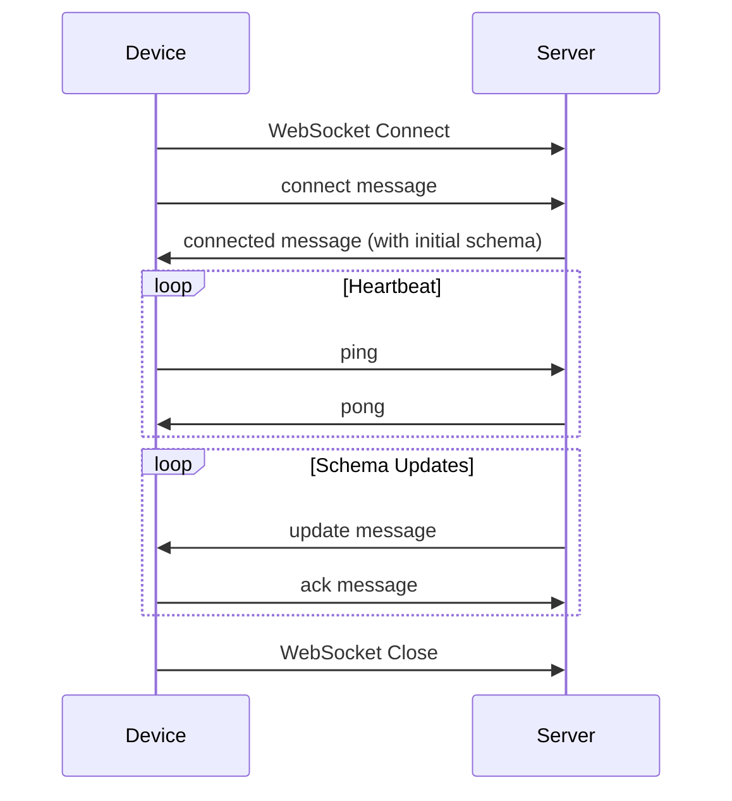

# Hot Reload Protocol Documentation

## Overview

The Hot Reload Protocol is a WebSocket-based communication protocol that enables real-time schema updates between the Lumora development server and connected devices. It supports both full schema replacements and incremental delta updates for efficient hot reloading.

## Protocol Version

Current version: `1.0.0`

## Connection Flow



## Message Types

### 1. Connect Message

Sent by device when establishing connection.

```typescript
{
  type: 'connect',
  sessionId: 'abc123',
  timestamp: 1234567890,
  version: '1.0.0',
  payload: {
    deviceId: 'device-uuid',
    platform: 'ios' | 'android' | 'web',
    deviceName: 'iPhone 14 Pro',
    clientVersion: '1.0.0'
  }
}
```

**Fields:**
- `deviceId`: Unique device identifier (UUID)
- `platform`: Device platform (ios, android, web)
- `deviceName`: Human-readable device name (optional)
- `clientVersion`: Client protocol version

### 2. Connected Message

Sent by server to acknowledge connection.

```typescript
{
  type: 'connected',
  sessionId: 'abc123',
  timestamp: 1234567890,
  version: '1.0.0',
  payload: {
    connectionId: 'conn-xyz',
    initialSchema: { /* LumoraIR */ },
    capabilities: {
      incrementalUpdates: true,
      compression: false,
      statePreservation: true
    }
  }
}
```

**Fields:**
- `connectionId`: Server-assigned connection identifier
- `initialSchema`: Initial schema to render (optional)
- `capabilities`: Server capabilities for feature negotiation

### 3. Update Message

Sent by server when schema changes.

```typescript
{
  type: 'update',
  sessionId: 'abc123',
  timestamp: 1234567890,
  version: '1.0.0',
  payload: {
    type: 'incremental' | 'full',
    schema?: { /* LumoraIR */ },
    delta?: {
      added: [/* LumoraNode[] */],
      modified: [/* LumoraNode[] */],
      removed: ['node-id-1', 'node-id-2'],
      metadataChanges: { /* optional */ }
    },
    preserveState: true,
    sequenceNumber: 42,
    checksum: 'sha256-hash'
  }
}
```

**Update Types:**

#### Full Update
- Contains complete `schema` object
- Used for initial load or major changes
- Replaces entire UI tree

#### Incremental Update
- Contains `delta` with specific changes
- More efficient for small changes
- Preserves unchanged parts of UI

**Fields:**
- `type`: Update type (full or incremental)
- `schema`: Complete schema (for full updates)
- `delta`: Incremental changes (for delta updates)
- `preserveState`: Whether to preserve app state
- `sequenceNumber`: Monotonically increasing number for ordering
- `checksum`: Optional hash for validation

### 4. Ack Message

Sent by device to acknowledge update receipt.

```typescript
{
  type: 'ack',
  sessionId: 'abc123',
  timestamp: 1234567890,
  version: '1.0.0',
  payload: {
    sequenceNumber: 42,
    success: true,
    error?: 'Error message if failed',
    applyTime: 150
  }
}
```

**Fields:**
- `sequenceNumber`: Sequence number being acknowledged
- `success`: Whether update was applied successfully
- `error`: Error message if update failed (optional)
- `applyTime`: Time taken to apply update in milliseconds (optional)

### 5. Reload Message

Sent by either party to request full reload.

```typescript
{
  type: 'reload',
  sessionId: 'abc123',
  timestamp: 1234567890,
  version: '1.0.0',
  payload: {
    reason: 'error' | 'manual' | 'incompatible',
    error?: 'Detailed error message'
  }
}
```

**Reasons:**
- `error`: Reload due to error in applying update
- `manual`: User-requested reload
- `incompatible`: Protocol or schema version incompatibility

### 6. Error Message

Sent by either party to report errors.

```typescript
{
  type: 'error',
  sessionId: 'abc123',
  timestamp: 1234567890,
  version: '1.0.0',
  payload: {
    code: 'ERROR_CODE',
    message: 'Human-readable error',
    severity: 'warning' | 'error' | 'fatal',
    details?: 'Stack trace or additional info',
    recoverable: true
  }
}
```

**Error Codes:**
- `INVALID_MESSAGE`: Malformed message
- `UNSUPPORTED_VERSION`: Protocol version mismatch
- `SESSION_NOT_FOUND`: Invalid session ID
- `SESSION_EXPIRED`: Session has expired
- `AUTHENTICATION_FAILED`: Authentication error
- `SCHEMA_VALIDATION_FAILED`: Invalid schema
- `UPDATE_FAILED`: Failed to apply update
- `CHECKSUM_MISMATCH`: Schema checksum validation failed
- `RATE_LIMIT_EXCEEDED`: Too many messages
- `INTERNAL_ERROR`: Server internal error

### 7. Ping Message

Sent by device for heartbeat.

```typescript
{
  type: 'ping',
  sessionId: 'abc123',
  timestamp: 1234567890,
  version: '1.0.0',
  payload?: {
    status: 'idle' | 'rendering' | 'updating'
  }
}
```

**Heartbeat Interval:** 30 seconds (recommended)

### 8. Pong Message

Sent by server in response to ping.

```typescript
{
  type: 'pong',
  sessionId: 'abc123',
  timestamp: 1234567890,
  version: '1.0.0',
  payload?: {
    serverTime: 1234567890
  }
}
```

## Schema Delta Format

The delta format describes incremental changes to the schema:

```typescript
interface SchemaDelta {
  added: LumoraNode[];      // New nodes
  modified: LumoraNode[];   // Changed nodes (full node replacement)
  removed: string[];        // IDs of removed nodes
  metadataChanges?: {       // Optional metadata updates
    version?: string;
    theme?: any;
    navigation?: any;
  };
}
```

### Delta Application Rules

1. **Removed nodes** are processed first
2. **Modified nodes** are processed second (full replacement)
3. **Added nodes** are processed last
4. Node IDs must be stable across updates
5. Parent-child relationships are preserved

### Delta Optimization

Server should use incremental updates when:
- Total changes < 10 nodes
- Changes are localized to specific subtree
- No structural changes to root

Server should use full updates when:
- Major structural changes
- More than 10 nodes changed
- Root node replaced
- Metadata significantly changed

## State Preservation

When `preserveState: true`:
- Device preserves all state variables
- Event handlers are re-bound
- Widget keys are used to match old/new widgets
- Scroll positions maintained where possible

When `preserveState: false`:
- Complete UI reset
- All state re-initialized
- Used for major structural changes

## Connection Management

### Heartbeat

- Client sends `ping` every 30 seconds
- Server responds with `pong`
- Connection considered dead after 3 missed pings (90 seconds)

### Reconnection

On connection loss:
1. Client attempts reconnection with exponential backoff
2. Initial retry: 1 second
3. Max retry interval: 30 seconds
4. Client sends new `connect` message
5. Server sends `connected` with current schema

### Session Expiry

- Sessions expire after 8 hours of inactivity
- Server sends `error` with `SESSION_EXPIRED` code
- Client must create new session

## Performance Considerations

### Message Size Limits

- Maximum message size: 10 MB
- Recommended delta size: < 100 KB
- Large schemas should be split or compressed

### Update Frequency

- Maximum update rate: 10 updates/second
- Debounce file changes: 100ms minimum
- Batch multiple file changes when possible

### Latency Targets

- Local network: < 500ms end-to-end
- Update application: < 2 seconds
- Heartbeat response: < 100ms

## Security

### Authentication

- Session ID acts as authentication token
- Session IDs are cryptographically random (UUID v4)
- Sessions are single-use and expire

### Rate Limiting

- Maximum 100 messages/second per connection
- Exceeded limit triggers `RATE_LIMIT_EXCEEDED` error
- Connection may be terminated for abuse

### Validation

- All messages validated against protocol schema
- Schema checksums verified when provided
- Malformed messages trigger `INVALID_MESSAGE` error

## Error Handling

### Client Error Handling

1. **Connection Errors**: Retry with exponential backoff
2. **Update Errors**: Send `ack` with error, request `reload`
3. **Validation Errors**: Display error overlay, allow manual reload
4. **Fatal Errors**: Show error screen with reconnect option

### Server Error Handling

1. **Invalid Messages**: Send `error`, continue connection
2. **Session Errors**: Send `error`, close connection
3. **Internal Errors**: Send `error`, attempt recovery
4. **Rate Limit**: Send `error`, throttle or disconnect

## Example Flows

### Successful Update Flow

```
Device -> Server: ping
Server -> Device: pong
[File changes on server]
Server -> Device: update (incremental)
Device -> Server: ack (success)
```

### Failed Update Flow

```
Server -> Device: update (incremental)
[Update fails on device]
Device -> Server: ack (failure)
Device -> Server: reload (reason: error)
Server -> Device: update (full)
Device -> Server: ack (success)
```

### Connection Loss Flow

```
[Network interruption]
Device: Detect connection loss
Device: Wait 1 second
Device -> Server: Reconnect WebSocket
Device -> Server: connect
Server -> Device: connected (with current schema)
Device -> Server: ack
```

## Version Compatibility

### Protocol Versioning

- Version format: `MAJOR.MINOR.PATCH`
- Breaking changes increment MAJOR
- New features increment MINOR
- Bug fixes increment PATCH

### Compatibility Rules

- Clients MUST support server's MAJOR version
- Clients SHOULD support server's MINOR version
- Servers SHOULD support older MINOR versions
- Version mismatch sends `UNSUPPORTED_VERSION` error

## Implementation Notes

### Server Implementation

- Use WebSocket library (ws, socket.io)
- Maintain session state in memory
- Calculate deltas efficiently
- Implement rate limiting
- Handle concurrent connections

### Client Implementation

- Use platform WebSocket API
- Parse messages with error handling
- Apply updates on main thread
- Implement reconnection logic
- Display error overlays

## Testing

### Test Scenarios

1. **Connection**: Establish and maintain connection
2. **Full Update**: Apply complete schema
3. **Incremental Update**: Apply delta changes
4. **State Preservation**: Verify state persists
5. **Error Recovery**: Handle and recover from errors
6. **Reconnection**: Reconnect after disconnect
7. **Heartbeat**: Maintain connection with pings
8. **Large Schema**: Handle schemas > 1MB
9. **Rapid Updates**: Handle multiple quick updates
10. **Network Issues**: Handle poor connectivity

## Future Enhancements

- Compression support (gzip, brotli)
- Binary protocol option (protobuf, msgpack)
- Multi-device sync
- Collaborative editing
- Time-travel debugging
- Performance profiling data
